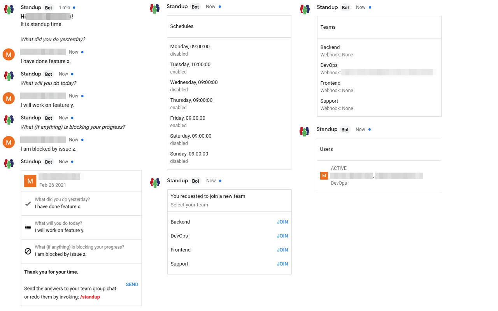
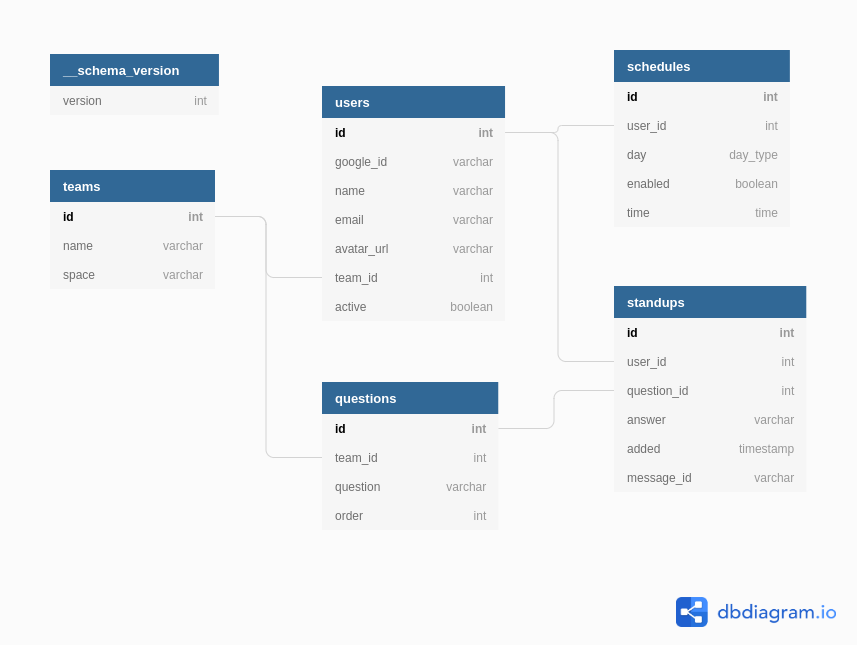

# Google Chat Standup Bot

This is a Google Chat bot for Google Workspace to ask the users the ~~three~~ defined standup questions. 
After the questions have been answered, the bot will publish the answers as a card to the group chat of the team. 
The standup questions can be either triggered automatically by a user configurable schedule, or manually by the user.

**Features**

* Supports different teams
* Bot publishes the standup answers to the team room
* Users can configure their own schedules, at which days and time they want to get a standup notification
* The questions are configurable per team
* The user can redo the standup questions, and the answers card will be updated in the team room

## Supported Slash Commands

| Command | Description | id |
| ------- | ----------- | ---|
| `/standup` | Triggers the standup questions. This can also retrigger the standup questions, if you made a mistake. | 6 |
| `/users [TEAM]` | List the users of the bot, optional filtered by the team. | 5 |
| `/teams` | List the available teams. | 3 |
| `/add_team TEAM` | Add a new team. | 1 |
| `/join_team` | Trigger to join another team. Will display an interactive card with teams to join. | 4 |
| `/leave_team` | Leave the team. | 11 |
| `/remove_team` | Remove a team. | 12 |
| `/schedules` | List the schedules. | 10 |
| `/enable_schedule` | Trigger to enable a schedule. Will display an interactive card with the schedules. | 8 |
| `/disable_schedule` | Trigger to disable a schedule. Will display an interactive card with the schedules. | 7 |
| `/change_schedule_time WEEKDAY TIME` | Change the schedule time of the weekday. | 9 |
| `/questions` | List the standup questions of your team. | 13 |
| `/add_question QUESTION` | Add a new standup quesiton for your team. | 14 |
| `/remove_question` | Remove a standup question from your team. | 15 |
| `/reorder_questions` | Reorder the standup questions of your team. | 16 |

When you set up the bot in your Google Workspace account, make sure to use the same ids for the slash commands as in the table above.

## Google Chat Setup

TBD

## Traefik

For the Traefik reverse proxy setup look at my [cloud-services](https://github.com/samuelba/cloud-services/tree/master/traefik) repository.

## Database Schema

See it on [dbdiagram.io](https://dbdiagram.io/d/60354600fcdcb6230b212562).

